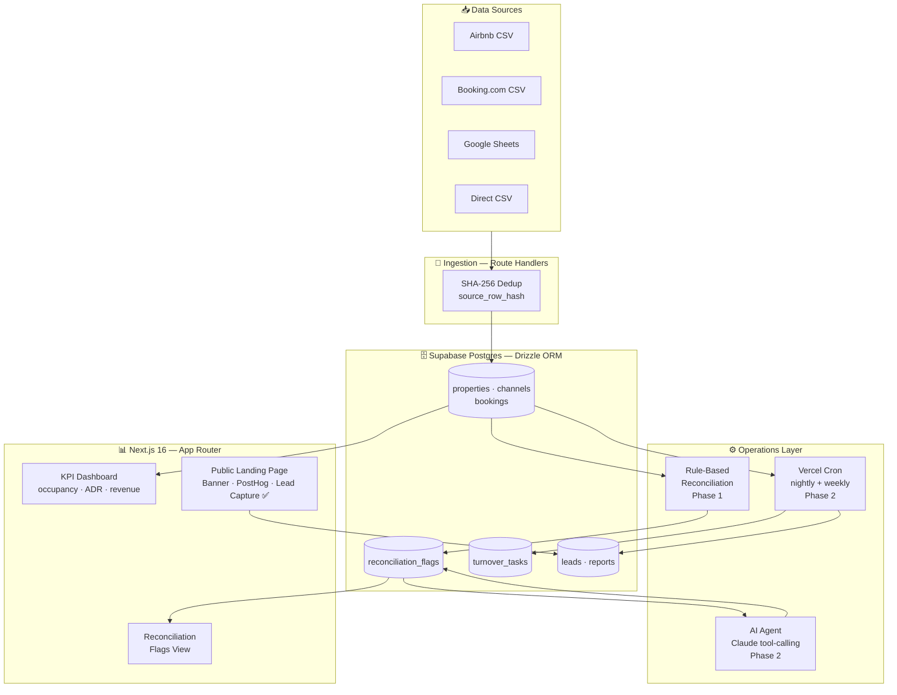
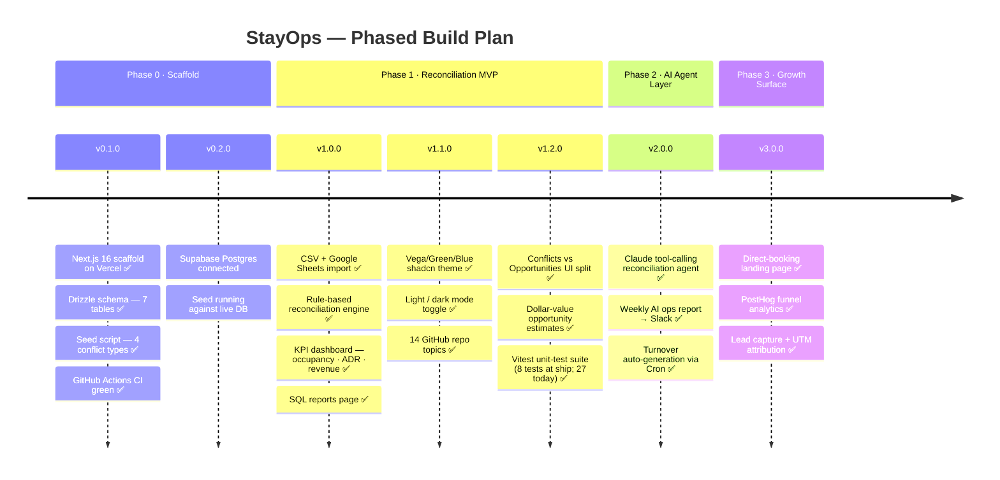

# 🏠 StayOps

## ⚡ Quick Summary

Short/mid-term rental operators manage bookings across Airbnb, Booking.com, and direct channels — reconciled manually in spreadsheets. **StayOps** replaces that workflow with a unified AI-assisted operations console, live on Vercel.

### What's live now — v3.0.0

- 📥 **Multi-channel ingestion** — CSV upload and Google Sheets API import; all rows deduplicated via SHA-256 `source_row_hash` so re-importing is always idempotent
- ⚙️ **Rule-based reconciliation engine** — detects four conflict types: duplicate bookings, double-bookings, pricing anomalies (>25% deviation from base rate), and upsell gap nights; writes structured flags with plain-English reasons
- 📊 **Live KPI dashboard** — occupancy %, ADR, gross revenue, and upcoming turnovers computed from real Postgres rows via `force-dynamic` server components
- 🗂️ **SQL reports page** — revenue by channel and property, ADR breakdown, and booking share %
- 🌙 **Light / dark mode** — system-aware theme toggle (OS preference respected on first load) with the Vega/Green/Blue shadcn preset
- 🤖 **AI reconciliation agent** — Claude tool-calling reads flagged conflicts, streams reasoning token-by-token, and proposes a resolution with a 0–100 confidence score; operator accepts or dismisses with 👍/👎 feedback
- ⏰ **Vercel Cron automation** — nightly turnover task generation + weekly AI-generated ops report with optional Slack delivery
- 🌐 **Public landing page** — full-width AI-generated property banner, hero section, animated metrics strip, 6-feature grid, PostHog funnel tracking, and lead capture form with UTM attribution into the `leads` table

### What's next

| Phase | Version | Features |
|---|---|---|
| **Phase 4 — Portfolio Polish** | `v4.0.0` | Dashboard theme · admin auth · Playwright E2E · README screenshots |

Built end-to-end with **Claude Code as the primary coding agent**. The reconciliation engine and AI agent layer are powered by Anthropic's Claude SDK with tool-calling. Every commit traces to a Claude Code session — demonstrating the AI-assisted internal tooling pattern central to modern rental-tech operator and data engineering roles.

### Multi-channel booking reconciliation engine + AI operations console, built end-to-end with Claude Code on Next.js 16 + Vercel

---

## 🏷️ Project Badges

[](https://nextjs.org/)
[](https://www.typescriptlang.org/)
[](https://orm.drizzle.team/)
[](https://supabase.com/)
[](https://www.anthropic.com/)
[](https://stayops-five.vercel.app)
[](https://github.com/deepan-mehta-analytics/stayops/actions)
[](https://github.com/deepan-mehta-analytics/stayops)

---

## 📌 Project Overview

This project implements a **full-stack AI-assisted operations console for multi-property short/mid-term rental operators**, built on Next.js 16 + Supabase with an Anthropic SDK agent layer.

It models the real-world operator workflow of importing bookings from Airbnb, Booking.com, and direct channels into a unified Postgres database, then running automated conflict detection before any human has to review a spreadsheet.

**Implemented (Phase 0 + Phase 1 — v1.2.0):**

- **Multi-channel ingestion** — CSV upload and Google Sheets API import route handlers; all rows deduplicated via SHA-256 `source_row_hash` so re-importing is always idempotent
- **Rule-based reconciliation engine** — detects four conflict types (duplicate bookings, double-bookings, pricing anomalies, upsell gaps) and writes structured `reconciliation_flags` with plain-English reasons
- **KPI dashboard** — occupancy %, average daily rate (ADR), gross revenue, and upcoming turnovers computed from live Postgres rows via server components
- **SQL reports page** — revenue by channel and property, ADR breakdown, booking share %
- **Light / dark mode** — system-aware theme toggle with the Vega/Green/Blue shadcn preset (next-themes)
- **7-table Drizzle schema** — typed, SQL-first ORM schema covering the full operational data model (properties, channels, bookings, reconciliation flags, turnover tasks, leads, reports)
- **Synthetic demo dataset** — seed script plants exactly 8 conflict events (2 per type) against a realistic backdrop of ~70 clean bookings, with dates computed relative to today so the demo always has live upcoming turnovers

**Implemented (Phase 2 — v2.0.0):**

- **AI reconciliation agent** — Claude tool-calling reads flagged rows, fetches booking and property context via tools, streams reasoning token-by-token, and proposes a resolution with a 0–100 confidence score
- **Operator review UI** — ConflictSlideOver panel with idle → streaming → proposal states; Accept writes audit trail (`acceptedBy`, `acceptedAt`, `aiConfidence`); 👍/👎 buttons capture training labels for Phase 3 ML
- **Automated ops reports** — Vercel Cron triggers nightly turnover task generation and weekly AI-generated Markdown summaries with option to deliver to Slack

**Implemented (Phase 3 — v3.0.0):**

- **Direct-booking growth surface** — public landing page with AI-generated property banner, PostHog funnel tracking (pageview → enquiry → lead capture → `leads` table with full UTM attribution), 6 review cards with modal, animated metrics strip, and lead capture form

**In progress (Phase 4 — portfolio polish):**

- **Dashboard theme alignment** — ops console visual identity matched to landing page brand
- **Admin authentication** — middleware-protected ops console with login page
- **Playwright E2E** — full end-to-end test suite against live Vercel deployment
- **README screenshots** — auto-captured from live pages

---

## ⚙️ Tech Stack

| Layer | Tool | Purpose |
|---|---|---|
| Framework | Next.js 16 (App Router, TypeScript) | Full-stack: API route handlers + React UI in one deploy |
| Hosting + Cron | Vercel | Live deploy from `main`; built-in Cron for nightly/weekly jobs |
| Database | Supabase (Postgres) | Serverless SQL with Row-Level Security; real SQL on display |
| ORM | Drizzle ORM | SQL-first, fully typed; keeps queries readable rather than hidden |
| Validation | Zod 4 | Runtime schema validation on all API boundaries |
| UI Components | shadcn/ui + Tailwind CSS 4 | Accessible component primitives; Vega style with Green/Blue preset |
| Theme | next-themes | System-aware light / dark mode; class injection on `<html>` |
| AI Agent | Anthropic SDK (`claude-sonnet-4-6`) | Tool-calling reconciliation agent + report generation (Phase 2) |
| Analytics | PostHog | Funnel events, session capture, conversion tracking (Phase 3) |
| Sheets Integration | Google Sheets API (service account) | Booking import/export — a real operator workflow |
| Automation | Vercel Cron | Scheduled reconciliation runs and weekly AI report delivery |
| CI | GitHub Actions (Node 24) | Lint + typecheck on every push to `main` |
| Seed | `tsx` + `crypto` | Deterministic, idempotent demo data generation |

---

## 🎯 Business Problem

Independent operators running 3–20 short/mid-term rental properties have no unified inbox. Bookings arrive from Airbnb, Booking.com, and direct enquiries simultaneously — and reconciliation happens manually in a spreadsheet at the end of the week.

**The daily pain:**

- 📅 **Double-bookings** — Airbnb and Booking.com calendars are synced by hand; a lag of minutes is enough to sell the same night twice
- 💸 **Pricing anomalies** — a nightly rate entered on one channel quietly diverges from the base rate on another; nobody notices until the guest checks out
- 🌙 **Gap nights** — 1–2 unsold nights between consecutive stays sit empty when a targeted early check-in offer or upsell message could fill them
- 📊 **No single view** — revenue, occupancy, and turnover schedules are scattered across three apps and a spreadsheet; there is no "Sunday morning dashboard"

Operators spend Sunday evenings firefighting instead of growing their portfolio.

> **How do you give a solo or small-team rental operator the kind of automated conflict detection and ops intelligence that only enterprise property management systems have — without the $500/month PMS subscription?**

---

## 🏗️ Architecture

### System Flow

```
[Airbnb CSV]  [Booking.com CSV]  [Google Sheets]  [Direct CSV]
       │               │               │               │
       └───────────────┴───────────────┴───────────────┘
                               │
                    ┌──────────▼──────────┐
                    │  Route Handlers     │  ← Next.js App Router
                    │  + Sheets API       │    /api/import/csv
                    │  SHA-256 dedup      │    /api/import/sheets
                    └──────────┬──────────┘
                               │
                    ┌──────────▼──────────────────────────┐
                    │       Supabase Postgres              │
                    │  (Drizzle schema — 7 tables)         │
                    │  properties · channels · bookings    │
                    │  reconciliation_flags · turnover_tasks│
                    │  leads · reports                     │
                    └──┬────────┬────────┬────────┬───────┘
                       │        │        │        │
              ┌────────▼──┐ ┌───▼────┐ ┌─▼────┐ ┌▼──────────┐
              │Reconcil-  │ │ KPI    │ │Vercel│ │ Public    │
              │iation     │ │Dash-   │ │Cron  │ │ Landing   │
              │Engine     │ │board   │ │jobs  │ │ Page ✅   │
              │rule pass  │ │shadcn  │ │      │ │ + Banner  │
              └────┬──────┘ └───┬────┘ └──┬───┘ └─────┬─────┘
                   │            │         │             │
              ┌────▼──────┐     │    ┌────▼──────┐ ┌───▼──────┐
              │AI Agent   │     │    │AI weekly  │ │ leads    │
              │Claude     │     │    │report     │ │ table    │
              │tool-call  │     │    │→ Slack    │ │+ PostHog │
              └───────────┘     │    └───────────┘ └──────────┘
                                │
                         ┌──────▼──────────┐
                         │   Ops Console   │
                         │ /dashboard      │
                         │ /reconciliation │
                         │ /bookings       │
                         │ /reports        │
                         └─────────────────┘
```

### Mermaid — Component Graph



### Component Reference

| Component | Layer | Status |
|---|---|---|
| `app/` — App Router pages and layouts | Frontend | ✅ Done |
| `db/schema.ts` — 7-table Drizzle schema | Data model | ✅ Done |
| `db/index.ts` — lazy `createDb()` factory | DB client | ✅ Done |
| `scripts/seed.ts` — idempotent demo data | Dev tooling | ✅ Done |
| `/api/import/csv` — CSV booking ingestion | Ingestion | ✅ Done |
| `/api/import/sheets` — Google Sheets import | Ingestion | ✅ Done |
| Reconciliation engine — 4 rule types | Operations | ✅ Done |
| `/dashboard` — KPI dashboard (occupancy · ADR · revenue) | Frontend | ✅ Done |
| `/reconciliation` — flags view with badge types | Frontend | ✅ Done |
| `/reports` — SQL revenue + ADR breakdown | Frontend | ✅ Done |
| `components/theme-provider.tsx` — next-themes wrapper | UI | ✅ Done |
| AI reconciliation agent (Claude tool-calling) | AI layer | ✅ Done |
| Vercel Cron — nightly reconcile + weekly report | Automation | ✅ Done |
| Weekly AI report → Slack webhook | Automation | ✅ Done |
| Public landing page + PostHog funnel | Growth | ✅ Done |
| Lead capture → `leads` table + UTM attribution | Growth | ✅ Done |
| AI-generated property banner (Gemini triptych) | Growth | ✅ Done |
| Admin authentication + protected ops console | Security | 🔄 Phase 4 |
| Dashboard theme — brand alignment | UI | 🔄 Phase 4 |
| Playwright E2E test suite | Testing | 🔄 Phase 4 |

### Built With AI (Claude Code)

This project is developed with **Claude Code as the primary coding agent** — every feature, schema decision, and architectural pattern is designed and implemented in AI-assisted sessions. The commit history traces directly to Claude Code sessions. This is an intentional design choice that demonstrates the "build internal tools with AI coding agents" capability the project is built to showcase.

---

## 📁 Repository Structure

```
stayops/
│
├── app/                          ← Next.js 16 App Router root
│   ├── layout.tsx                ← Bare HTML shell — fonts + globals only
│   ├── globals.css               ← Tailwind base + CSS variables (Vega/Green/Blue preset)
│   ├── (marketing)/              ← Route group — landing page (light, Poppins, PostHog)
│   │   ├── layout.tsx            ← Marketing layout — Poppins font, OG metadata
│   │   └── page.tsx              ← Landing page — banner + hero + sections + lead form
│   └── (app)/                    ← Route group — ops console (theme toggle, nav)
│       ├── layout.tsx            ← App layout — ThemeProvider + Nav wrapper
│       └── dashboard/page.tsx    ← KPI dashboard (moved from root)
│
├── components/
│   ├── nav.tsx                   ← Ops console nav — Dashboard/Bookings/Reconciliation/Reports
│   ├── theme-provider.tsx        ← next-themes wrapper (system-aware)
│   ├── conflict-slide-over.tsx   ← AI analysis panel — idle/streaming/proposal states
│   ├── reconciliation-client.tsx ← Client boundary: row selection + slide-over wiring
│   ├── marketing/                ← Landing page components (Phase 3)
│   │   ├── marketing-nav.tsx     ← Sticky transparent nav — Features / How it works / Request Demo
│   │   ├── property-banner.tsx   ← Full-bleed AI-generated triptych banner (Gemini)
│   │   ├── hero.tsx              ← Dark gradient hero — headline + screenshot card + CTAs
│   │   ├── metrics-strip.tsx     ← Animated counter strip (IntersectionObserver count-up)
│   │   ├── features-grid.tsx     ← 6 feature cards with stagger animation
│   │   ├── how-it-works.tsx      ← 3-step horizontal flow section
│   │   ├── social-proof.tsx      ← 6 review cards (auto-fill grid) + reviews modal
│   │   ├── lead-form.tsx         ← Lead capture form with PostHog funnel events
│   │   └── posthog-provider.tsx  ← PHProvider wrapper (init via instrumentation-client.ts)
│   └── ui/
│       └── button.tsx            ← shadcn Button primitive
│
├── db/
│   ├── schema.ts                 ← Drizzle schema — all 7 tables + Phase 2 audit columns
│   └── index.ts                  ← Lazy createDb() factory (dotenv-safe)
│
├── scripts/
│   ├── seed.ts                   ← Idempotent seed: 4 conflict types × 2 instances + ~70 clean bookings
│   └── reset-flags.ts            ← Truncates reconciliation_flags so the engine re-classifies on next load
│
├── lib/
│   ├── reconciliation.ts         ← Pure classifyBookings() engine + runReconciliation() orchestrator
│   ├── reconciliation.test.ts    ← Vitest — 8 fixtures for classifyBookings()
│   ├── ai-agent.ts               ← Claude tool-calling agent: tools, system prompt, streamAnalysis(), resolveFlag()
│   ├── ai-agent.test.ts          ← Vitest — 8 fixtures for agent tools, prompt, resolveFlag()
│   ├── weekly-report.ts          ← getCurrentIsoWeek(), formatWeeklyReport(), buildWeeklyReport()
│   ├── weekly-report.test.ts     ← Vitest — 7 fixtures for ISO week + report formatting
│   ├── dashboard-queries.ts      ← Server-side query functions (KPI metrics, conflict count)
│   ├── import-pipeline.ts        ← Shared CSV/Sheets parsing and upsert logic
│   └── utils.ts                  ← cn() utility (clsx + tailwind-merge)
│
├── public/                       ← Static assets
│   └── banner-properties.png     ← AI-generated STR triptych (Gemini — beach/mountain/city)
│
├── instrumentation-client.ts     ← PostHog init (client-side, marketing pages only)
│
├── .github/
│   └── workflows/
│       └── ci.yml                ← GitHub Actions: lint + typecheck + unit tests on every push (Node 24)
│
├── app/
│   └── api/
│       ├── ai/
│       │   ├── analyze/route.ts  ← POST: stream Claude analysis for a flag
│       │   ├── resolve/route.ts  ← POST: accept proposal, write audit trail
│       │   └── feedback/route.ts ← POST: record 👍/👎 without resolving
│       └── cron/
│           ├── weekly-report/route.ts     ← POST: generate + deliver weekly report (CRON_SECRET guarded)
│           └── generate-turnovers/route.ts ← POST: idempotent nightly turnover creation
│
├── .env.local.example            ← All required env vars documented with comments
├── vercel.json                   ← Cron schedules: weekly-report (Mon 08:00 UTC) + turnovers (daily midnight)
├── drizzle.config.ts             ← Drizzle Kit config pointing to Supabase
├── next.config.ts                ← Next.js 16 configuration
├── components.json               ← shadcn/ui registry config
├── tsconfig.json                 ← TypeScript strict mode
├── package.json                  ← npm scripts: dev · build · lint · seed · db:*
└── postcss.config.mjs            ← Tailwind CSS 4 PostCSS plugin
```

---

## ▶️ How to Run

### 📋 Prerequisites

- Node.js 20+ (project CI runs on Node 24)
- A [Supabase](https://supabase.com) project (free tier)
- `npm` or equivalent

### 🗂️ Option 1 — Local Development

#### 1. Clone the repository

```bash
git clone https://github.com/deepan-mehta-analytics/stayops.git
cd stayops
```

#### 2. Install dependencies

```bash
npm install
```

#### 3. Configure environment variables

```bash
cp .env.local.example .env.local
```

Open `.env.local` and fill in the required variables:

| Variable | Required for | Where to find it |
|---|---|---|
| `DATABASE_URL` | All DB operations | Supabase → Settings → Database → Connection string (Transaction pooler) |
| `NEXT_PUBLIC_SUPABASE_URL` | Client auth | Supabase → Settings → API → Project URL |
| `NEXT_PUBLIC_SUPABASE_ANON_KEY` | Client auth | Supabase → Settings → API → anon/public key |
| `ANTHROPIC_API_KEY` | Phase 2 (AI agent) | [console.anthropic.com](https://console.anthropic.com) → API Keys |
| `SLACK_WEBHOOK_URL` | Phase 2 (reports) | api.slack.com → Apps → Incoming Webhooks |
| `GOOGLE_SERVICE_ACCOUNT_JSON` | Phase 1 (Sheets) | GCP Console → IAM → Service Accounts → JSON key |
| `NEXT_PUBLIC_POSTHOG_PROJECT_TOKEN` | Phase 3 (analytics) | us.posthog.com → Project Settings |
| `NEXT_PUBLIC_POSTHOG_HOST` | Phase 3 (analytics) | `https://us.i.posthog.com` (or eu.i for EU accounts) |

#### 4. Run database migrations

```bash
npm run db:generate    # generate SQL migration files from schema
npm run db:migrate     # apply migrations to Supabase
```

#### 5. Seed the demo dataset

```bash
npm run seed
```

Expected output:

```
🌱 Truncating tables...
✓ Tables cleared
✓ 4 properties
✓ 12 channels
✓ 16 conflict-related bookings planted
✓ ~70 clean bookings

━━━━━━━━━━━━━━━━━━━━━━━━━━━━━━━━━━━━━━━━━━━━
✅  Seed complete — ~86 bookings across 4 properties
━━━━━━━━━━━━━━━━━━━━━━━━━━━━━━━━━━━━━━━━━━━━

Planted conflicts (ID prefixes):
  duplicate       × 2  → ...
  double_book     × 2  → ...
  gap             × 2  → ...
  price_mismatch  × 2  → ...
```

#### 6. Start the development server

```bash
npm run dev
```

Open [http://localhost:3000](http://localhost:3000).

### ☁️ Option 2 — Live Demo (Vercel)

The app is deployed and publicly accessible at:

**[https://stayops-five.vercel.app](https://stayops-five.vercel.app)**

> The live demo requires the Supabase database to be seeded. See "Known Limitations" for current demo status.

### 🔧 Available Scripts

| Script | Purpose |
|---|---|
| `npm run dev` | Start Next.js 16 dev server with hot reload |
| `npm run build` | Production build |
| `npm run lint` | ESLint across all TypeScript files |
| `npx tsc --noEmit` | TypeScript typecheck (no output files) |
| `npm test` | Run Vitest unit suite (27 tests — reconciliation, AI agent, weekly report, leads API) |
| `npm run seed` | Truncate all tables and repopulate with demo data |
| `npm run reset:flags` | Clear `reconciliation_flags` so engine re-classifies on next `/reconciliation` load |
| `npm run db:generate` | Generate SQL migration files from `db/schema.ts` |
| `npm run db:migrate` | Apply pending migrations to Supabase |
| `npm run db:studio` | Open Drizzle Studio — visual DB browser |

---

## 🧪 Tests

### Current Coverage — Phase 1 + Phase 2

| Check | Tool | Runs on |
|---|---|---|
| Lint | ESLint (`eslint-config-next`) | Every push to `main` via CI |
| Type check | TypeScript `tsc --noEmit` | Every push to `main` via CI |
| Unit tests | Vitest — 4 test files, 27 tests | Every push to `main` via CI |

CI runs on Node 24 with two parallel jobs (Lint & Typecheck + Unit Tests). All runs green on `main`.

```bash
# Run locally
npm run lint
npx tsc --noEmit
npm test                   # vitest run — 27 unit tests
```

**Unit test coverage** — 27 tests across 4 modules:

Phase 1 — `classifyBookings()` pure function, 8 fixtures:
- `double_book` detection for overlapping guests on the same property
- `duplicate` detection from two channels (different `sourceRowHash`)
- `orphan_night` for 1-night unsellable gaps (no `estimatedValue`)
- `gap` (opportunity) for 2-night gaps with dollar estimate
- 4-night boundary pin — no flag emitted (intentional vacancy threshold)
- Multi-property numeric sum guard (Drizzle returns `numeric` as JS strings)
- `price_mismatch` detection for >25% rate deviation
- Back-to-back clean bookings → zero flags

Phase 2 — `lib/ai-agent.ts`, 8 fixtures:
- Tool schema shape and required fields on `propose_resolution`
- `CHANNEL_PRIORITY` ordering (Airbnb first)
- System prompt structure and channel-priority interpolation
- `resolveFlag()` DB write sequence

Phase 2 — `lib/weekly-report.ts`, 7 fixtures:
- `getCurrentIsoWeek()` format (`YYYY-Www`) and year-boundary correctness
- `formatWeeklyReport()` renders conflict count, revenue, top property, null-property fallback

Phase 3 — `lib/leads-api.test.ts`, 4 fixtures:
- Valid email → 201 + DB insert
- Honeypot filled → 200, no insert (silent bot reject)
- Invalid email → 400, no insert
- Optional fields (propertyCount, channelsUsed, message) passed through correctly

### Roadmap — Integration and E2E Tests

API route handler integration tests and Playwright end-to-end tests are planned for Phase 4 portfolio polish.

---

## 📊 Results / Performance

### Seed Data (Supabase + demo dataset)

The seed script produces the following dataset against the live Supabase instance:

| Metric | Value |
|---|---|
| Properties seeded | 4 (Lakeview Cottage, Downtown Studio, Beach House, Mountain Cabin) |
| Channels per property | 3 (airbnb, booking, direct) — 12 total |
| Conflict bookings planted | 16 rows across 8 conflict events |
| Clean bookings generated | ~70 (varies slightly by date; max 18/property) |
| Total bookings | ~86 |
| Conflict types covered | 4 / 4 (duplicate, double_book, gap, price_mismatch) |
| Instances per type | 2 (each detection branch exercised twice) |
| Date range | T−30 to T+60 relative to run date — turnovers always in the future |

**Planted conflict detail:**

| Type | Properties | Scenario |
|---|---|---|
| `duplicate` ×2 | Lakeview Cottage, Downtown Studio | Same guest + same exact dates imported from two channels with different `source_row_hash` |
| `double_book` ×2 | Beach House, Mountain Cabin | Two different guests, overlapping date ranges (3-night overlap; 2-night overlap) |
| `gap` ×2 | Downtown Studio (1-night), Lakeview Cottage (2-night) | Unsold nights between consecutive confirmed bookings |
| `price_mismatch` ×2 | Lakeview Cottage (+50%), Beach House (−45%) | Nightly rate deviating >25% from property base rate |

### Phase 1 — Reconciliation Engine Results

End-to-end results against the live Supabase seed dataset:

| Metric | Value |
|---|---|
| Planted conflict events detected | 8 / 8 (100%) |
| Conflict types covered | 4 / 4 (duplicate, double_book, gap, price_mismatch) |
| Orphan-night flags (1-night unsellable gaps) | ~64 (classified as `orphan_night`; shown as footnote, not conflict) |
| Revenue opportunity flags (2–3 night gaps) | 2 (classified as `gap`; shown with `$` estimate) |
| Total reconciliation flags written | ~72 |
| Engine implementation | Pure in-memory TypeScript — no SQL CTEs required at <1,000 rows |
| Latency | Sub-second on Supabase free tier |

The gap flag count is intentionally high: the seed's 1-day buffer between consecutive clean bookings is itself a gap, and the engine flags every unsold night between confirmed stays — matching real operator behaviour.

### Phase 2 — AI Agent

Phase 2 shipped (v2.0.0). `ANTHROPIC_API_KEY` is configured in Vercel and the AI agent is live in production. Runtime benchmarks (resolution accuracy, reasoning trace quality, average tokens per flag) will be recorded as usage data accumulates.

---

## ⚠️ Known Limitations

- **No auth / multi-user support** — single-operator demo mode only; Row-Level Security policies and user management are post-MVP scope
- **No real channel APIs** — Airbnb has no public API; Booking.com requires enterprise access. CSV and Google Sheets import is the realistic operator workflow, matching how operators actually export their booking data
- **Gap flag classification** — 1-night "orphan" windows between stays are detected but shown only as a footnote count (typically unsellable under a 2-night minimum). 2–3 night gaps are shown as revenue Opportunities with a `$` estimate. 4+ night gaps are treated as intentional vacancy and not flagged.
- **`npm run seed` requires `DATABASE_URL`** — copy `.env.local.example` to `.env.local` and add Supabase credentials before running the seed script locally
- **Phase 2 AI features require `ANTHROPIC_API_KEY` in `.env.local` for local development** — the key is configured in Vercel production; copy `.env.local.example` and add the key to run the agent locally
- **Phase 3 analytics require `NEXT_PUBLIC_POSTHOG_PROJECT_TOKEN` and `NEXT_PUBLIC_POSTHOG_HOST`** — configured in Vercel production; add to `.env.local` for local funnel testing

## 🔜 Roadmap

### Mermaid — Phased Build Plan



### Version Checklist

| Version | Milestone | Status |
|---|---|---|
| `v0.1.0` | Phase 0 scaffold — Next.js + Vercel live, schema, seed script, CI | ✅ [Released](https://github.com/deepan-mehta-analytics/stayops/releases/tag/v0.1.0) |
| `v0.2.0` | Phase 0 complete — Supabase connected, seed running, demo data live | ✅ Done |
| `v1.0.0` | **MVP** — CSV/Sheets import + reconciliation engine + KPI dashboard | ✅ [Released 2026-05-30](https://github.com/deepan-mehta-analytics/stayops/releases/tag/v1.0.0) |
| `v1.1.0` | Vega/Green/Blue theme + light/dark mode + 14 repo topics | ✅ [Released 2026-05-30](https://github.com/deepan-mehta-analytics/stayops/releases/tag/v1.1.0) |
| `v1.2.0` | Conflicts/Opportunities UI split + dollar estimates + Vitest suite (8 tests at ship, CI) | ✅ [Released 2026-05-30](https://github.com/deepan-mehta-analytics/stayops/releases/tag/v1.2.0) |
| `v2.0.0` | AI agent layer — Claude tool-calling + Slack reports + turnover cron | ✅ [Released 2026-05-31](https://github.com/deepan-mehta-analytics/stayops/releases/tag/v2.0.0) |
| `v3.0.0` | Growth surface — landing page + PostHog funnel + lead capture | ✅ [Released 2026-05-31](https://github.com/deepan-mehta-analytics/stayops/releases/tag/v3.0.0) |

---

## 📂 Dataset

StayOps uses a **synthetically generated demo dataset** — there is no external public dataset. The seed script (`scripts/seed.ts`) generates all data programmatically at runtime against a live Supabase instance.

**Design principles:**

- All dates are computed relative to the run date (`today + N` days), so the demo always shows current upcoming turnovers regardless of when it is run
- Clean bookings fill in around conflict windows automatically using an occupation-tracker; no two bookings on the same property ever overlap except the deliberately planted `double_book` events
- Guest names are drawn from a 20-name pool, cycled deterministically, so the dataset looks realistic without requiring any PII
- The seed is idempotent: running it twice truncates all tables before repopulating, so the dataset is always in a known state

**Properties and base rates:**

| Property | Location | Base Rate | Capacity |
|---|---|---|---|
| Lakeview Cottage | 42 Lake Rd, Tahoe, CA | $150/night | 4 guests |
| Downtown Studio | 8 Main St, Nashville, TN | $95/night | 2 guests |
| Beach House | 15 Ocean Dr, Miami, FL | $280/night | 8 guests |
| Mountain Cabin | 301 Pine Ln, Asheville, NC | $185/night | 6 guests |

---

## 👤 Author

**Deepan Mehta**

- Data Analytics → Data Engineering → AI/ML Engineering
- Focused on building end-to-end data and ML systems combining analytics, automation, and AI agent workflows
- Experience in ETL pipelines, predictive modelling, analytical databases, and AI-assisted tool development

🔗 GitHub: [deepan-mehta-analytics](https://github.com/deepan-mehta-analytics)
🌐 Live: [stayops-five.vercel.app](https://stayops-five.vercel.app)
